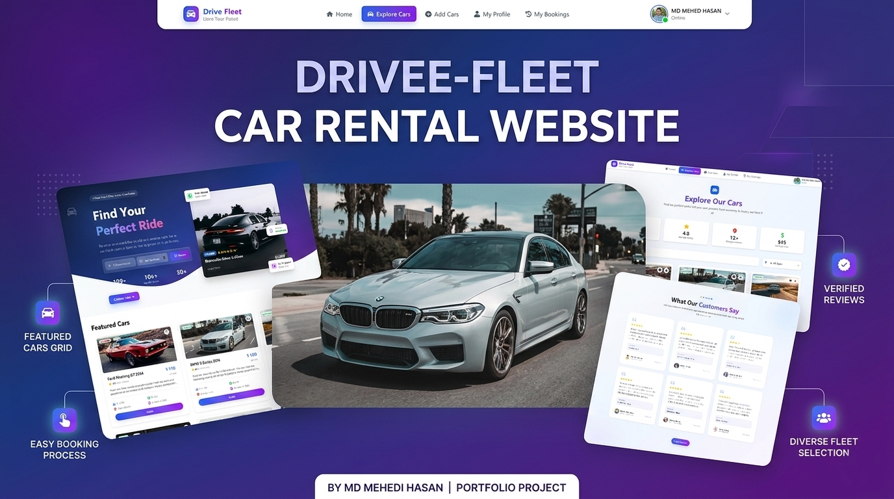

<div align="center">

# 🚗 Drive Fleet

### _Drive Your Dream_

A modern, full-featured car rental platform built with Next.js — browse a premium fleet, book instantly, and manage your rentals with ease.



[](https://drivee-fleet.vercel.app)
[](https://nextjs.org/)
[](https://react.dev/)
[](LICENSE)

</div>

---

## 📋 Table of Contents

- [Overview](#-overview)
- [Features](#-features)
- [Tech Stack](#-tech-stack)
- [Getting Started](#-getting-started)
- [Project Structure](#-project-structure)
- [Environment Variables](#-environment-variables)
- [Scripts](#-scripts)
- [Live Demo](#-live-demo)
- [Contributing](#-contributing)
- [License](#-license)

---

## 🌟 Overview

**Drive Fleet** is a full-stack car rental web application where users can discover hundreds of premium vehicles, book rentals seamlessly, and manage their bookings — all from a polished, responsive UI.

The platform supports customer-facing features like browsing, filtering, and booking cars, as well as host/owner features like listing and managing vehicles.

> Trusted by **10,000+** customers across **50+** cities.

---

## ✨ Features

- **🔍 Car Exploration** — Browse and filter 500+ premium vehicles by type, location, price, and availability
- **📅 Instant Booking** — Real-time availability checking and streamlined booking flow
- **🔐 Authentication** — Secure sign-up, login, and session management via `better-auth`
- **👤 User Profiles** — Manage personal details, view rental history, and track active bookings
- **🚘 Car Listings** — Hosts can add, update, and manage their own vehicle listings
- **⭐ Reviews & Ratings** — Customers can rate and review their rental experience
- **📱 Responsive Design** — Fully optimized for desktop, tablet, and mobile
- **🎨 Smooth Animations** — Fluid transitions and interactions powered by Framer Motion

---

## 🛠 Tech Stack

| Category              | Technology                                                |
| --------------------- | --------------------------------------------------------- |
| **Framework**         | [Next.js 16.2.6](https://nextjs.org/) (App Router)        |
| **UI Library**        | [React 19](https://react.dev/)                            |
| **Component Library** | [HeroUI v3](https://heroui.com/)                          |
| **Styling**           | [Tailwind CSS v4](https://tailwindcss.com/)               |
| **Authentication**    | [Better Auth](https://www.better-auth.com/)               |
| **Database Adapter**  | MongoDB via `@better-auth/mongo-adapter`                  |
| **Icons**             | [React Icons](https://react-icons.github.io/react-icons/) |
| **Language**          | JavaScript (ES2022+)                                      |
| **Deployment**        | [Vercel](https://vercel.com/)                             |

---

## 🚀 Getting Started

### Prerequisites

- **Node.js** v18 or higher
- **npm** v9 or higher
- A **MongoDB** database (local or [MongoDB Atlas](https://www.mongodb.com/atlas))

### Installation

1. **Clone the repository**

   ```bash
   git clone https://github.com/mehedi-hasan2006/drive-fleet-client.git
   cd drive-fleet-client
   ```

2. **Install dependencies**

   ```bash
   npm install
   ```

3. **Set up environment variables**

   Create a `.env.local` file in the root directory and add the required variables (see [Environment Variables](#-environment-variables)).

4. **Run the development server**

   ```bash
   npm run dev
   ```

5. **Open your browser**

   Navigate to [http://localhost:3000](http://localhost:3000) to see the app running.

---

## 📁 Project Structure

```
drive-fleet-client/
├── public/             # Static assets (images, icons, fonts)
├── src/
│   ├── app/            # Next.js App Router pages & layouts
│   │   ├── (auth)/     # Authentication routes (login, register)
│   │   ├── explore-cars/
│   │   ├── car-details/[id]/
│   │   ├── add-car/
│   │   ├── my-profile/
│   │   ├── my-bookings/
│   │   └── page.js     # Home page
│   ├── components/     # Reusable UI components
│   ├── lib/            # Utility functions and config (auth, db)
│   └── styles/         # Global styles
├── .env.local          # Local environment variables (not committed)
├── next.config.mjs     # Next.js configuration
├── tailwind.config.js  # Tailwind CSS configuration
├── jsconfig.json       # JavaScript path aliases
└── package.json
```

---

## 🔑 Environment Variables

Create a `.env.local` file at the project root and populate it with the following:

```env
# MongoDB
MONGODB_URI=your_mongodb_connection_string

# Better Auth
BETTER_AUTH_SECRET=your_secret_key
BETTER_AUTH_URL=http://localhost:3000

# App
NEXT_PUBLIC_API_URL=http://localhost:3000
```

> ⚠️ Never commit your `.env.local` file. It is already excluded via `.gitignore`.

---

## 📜 Scripts

| Command         | Description                         |
| --------------- | ----------------------------------- |
| `npm run dev`   | Start the development server        |
| `npm run build` | Create a production build           |
| `npm run start` | Run the production build locally    |
| `npm run lint`  | Run ESLint to check for code issues |

---

## 🌐 Live Demo

The application is deployed on Vercel and available at:

**[https://drivee-fleet.vercel.app](https://drivee-fleet.vercel.app)**

### Pages at a Glance

| Route               | Description                                      |
| ------------------- | ------------------------------------------------ |
| `/`                 | Home — hero section, featured cars, testimonials |
| `/explore-cars`     | Browse and filter the full car catalog           |
| `/car-details/[id]` | Individual car details and booking               |
| `/add-car`          | List a new vehicle (authenticated hosts)         |
| `/my-profile`       | User profile management                          |
| `/my-bookings`      | View and manage active bookings                  |
| `/register`         | Create a new account                             |

---

## 🤝 Contributing

Contributions, issues, and feature requests are welcome!

1. Fork the repository
2. Create a new branch: `git checkout -b feature/your-feature-name`
3. Make your changes and commit: `git commit -m "feat: add your feature"`
4. Push to your branch: `git push origin feature/your-feature-name`
5. Open a Pull Request

Please ensure your code passes linting (`npm run lint`) before submitting a PR.

---

## 📄 License

This project is licensed under the **MIT License**. See the [LICENSE](LICENSE) file for details.

---

<div align="center">

Made with ❤️ by the **Drive Fleet Team**

⭐ If you find this project helpful, please consider giving it a star!

</div>
